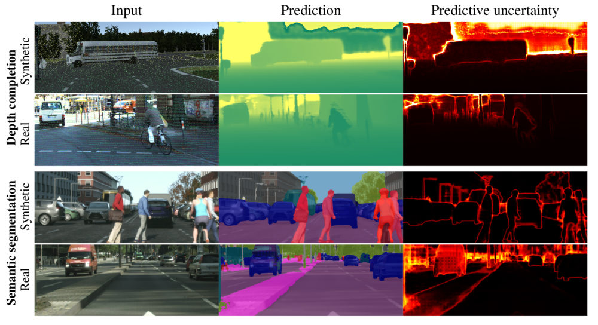

# evaluating_bdl

This repository contains the official implementation (PyTorch) of the paper [Evaluating Scalable Bayesian Deep Learning Methods for Robust Computer Vision](), 2019.



Blabla, video, description / short abstract, bibtex....TODO! TODO!

If you find this work useful, please consider citing:
```
TODO! TODO! TODO!
```


## Acknowledgements

- The depthCompletion code is based on the implementation by [@fangchangma](https://github.com/fangchangma) found [here](https://github.com/fangchangma/self-supervised-depth-completion).
- The segmentation code is based on the implementation by [@PkuRainBow](https://github.com/PkuRainBow) found [here](https://github.com/PkuRainBow/OCNet.pytorch), which in turn utilizes [inplace_abn](https://github.com/mapillary/inplace_abn) by [@mapillary](https://github.com/mapillary).


## Index
- [Usage](#usage)
- - [depthCompletion](#depthcompletion)
- - [segmentation](#segmentation)
- - [toyRegression](#toyregression)
- - [toyClassification](#toyclassification)
- [Documentation](#documentation)
- - [depthCompletion](#documentationdepthcompletion)
- - [segmentation](#documentationsegmentation)
- - [toyRegression](#documentationtoyregression)
- - [toyClassification](#documentationtoyclassification)
- [Pretrained models](#pretrained-models)
***
***
***


***
***
***
## Usage

The code has been tested on Ubuntu 16.04. Docker images are provided (see below).

- [depthCompletion](#depthcompletion)
- [segmentation](#segmentation)
- [toyRegression](#toyregression)
- [toyClassification](#toyclassification)


### depthCompletion

- $ sudo docker pull fregu856/evaluating_bdl:pytorch_pytorch_0.4_cuda9_cudnn7_evaluating_bdl
- Create _start_docker_image_toyProblems_depthCompletion.sh_ containing (My username on the server is _fregu482_, i.e., my home folder is _/home/fregu482_. You will have to modify this accordingly):
```
#!/bin/bash

# DEFAULT VALUES
GPUIDS="0"
NAME="toyProblems_depthCompletion_GPU"

NV_GPU="$GPUIDS" nvidia-docker run -it --rm --shm-size 12G \
        -p 5700:5700\
        --name "$NAME""0" \
        -v /home/fregu482:/root/ \
        fregu856/evaluating_bdl:pytorch_pytorch_0.4_cuda9_cudnn7_evaluating_bdl bash
```
- (Inside the image, _/root/_ will now be mapped to _/home/fregu482_, i.e., $ cd -- takes you to the regular home folder)
- (To create more containers, change the lines _GPUIDS="0"_, _--name "$NAME""0"_ and _-p 5700:5700_)
- General Docker usage:
- - To start the image:
- - - $ sudo sh start_docker_image_toyProblems_depthCompletion.sh
- - To commit changes to the image:
- - - Open a new terminal window.
- - - $ sudo docker commit toyProblems_depthCompletion_GPU0 fregu856/evaluating_bdl:pytorch_pytorch_0.4_cuda9_cudnn7_evaluating_bdl
- - To exit the image without killing running code:
- - - Ctrl + P + Q
- - To get back into a running image:
- - - $ sudo docker attach toyProblems_depthCompletion_GPU0


- Download the [KITTI depth completion](http://www.cvlibs.net/datasets/kitti/eval_depth.php?benchmark=depth_completion) dataset (_data_depth_annotated.zip_, _data_depth_selection.zip_ and _data_depth_velodyne.zip_) and place it in _/root/data/kitti_depth_ (_/root/data/kitti_depth_ should contain the folders _train_, _val_ and _depth_selection_).

- Create _/root/data/kitti_raw_ and download the [KITTI raw](http://www.cvlibs.net/datasets/kitti/raw_data.php) dataset using [download_kitti_raw.py](https://github.com/fregu856/evaluating_bdl/blob/master/depthCompletion/utils/download_kitti_raw.py).

- Create _/root/data/kitti_rgb_. For each folder in _/root/data/kitti_depth/train_ (e.g. _2011_09_26_drive_0001_sync_), copy the corresponding folder in _/root/data/kitti_raw_ and place it in _/root/data/kitti_rgb/train_.


- Download the [virtual KITTI](https://europe.naverlabs.com/Research/Computer-Vision/Proxy-Virtual-Worlds/) dataset (_vkitti_1.3.1_depthgt.tar_ and _vkitti_1.3.1_rgb.tar_) and place in _/root/data/virtualkitti_ (_/root/data/virtualkitti_ should contain the folders _vkitti_1.3.1_depthgt_ and _vkitti_1.3.1_rgb_).


- Example usage:
```
$ sudo sh start_docker_image_toyProblems_depthCompletion.sh
$ cd --
$ python evaluating_bdl/depthCompletion/ensembling_train_virtual.py
```
***
***
***


### segmentation

- $ sudo docker pull fregu856/evaluating_bdl:rainbowsecret_pytorch04_20180905_evaluating_bdl
- Create _start_docker_image_segmentation.sh_ containing (My username on the server is _fregu482_, i.e., my home folder is _/home/fregu482_. You will have to modify this accordingly):
```      
#!/bin/bash

# DEFAULT VALUES
GPUIDS="0,1"
NAME="segmentation_GPU"

NV_GPU="$GPUIDS" nvidia-docker run -it --rm --shm-size 12G \
        -p 5900:5900 \
        --name "$NAME""01" \
        -v /home/fregu482:/home/ \
        fregu856/evaluating_bdl:rainbowsecret_pytorch04_20180905_evaluating_bdl bash
```
- (Inside the image, _/home/_ will now be mapped to _/home/fregu482_, i.e., $ cd home takes you to the regular home folder)
- (To create more containers, change the lines _GPUIDS="0,1"_, _--name "$NAME""01"_ and _-p 5900:5900_)
- General Docker usage:
- - To start the image:
- - - $ sudo sh start_docker_image_segmentation.sh
- - To commit changes to the image:
- - - Open a new terminal window.
- - - $ sudo docker commit segmentation_GPU01 fregu856/evaluating_bdl:rainbowsecret_pytorch04_20180905_evaluating_bdl
- - To exit the image without killing running code:
- - - Ctrl + P + Q
- - To get back into a running image:
- - - $ sudo docker attach segmentation_GPU01


- Download _resnet101-imagenet.pth_ from [here](http://sceneparsing.csail.mit.edu/model/pretrained_resnet/resnet101-imagenet.pth) and place it in _segmentation_.

- Download the [Cityscapes](https://www.cityscapes-dataset.com/) dataset and place it in _/home/data/cityscapes_ (_/home/data/cityscapes_ should contain the folders _leftImg8bit_ and _gtFine_).

- Download the [Synscapes](https://7dlabs.com/synscapes-overview) dataset and place it in _/home/data/synscapes_ (_/home/data/synscapes_ should contain the folder _img_, which in turn should contain the folders _rgb-2k_ and _class_).

- Run _segmentation/utils/preprocess_synscapes.py_ (This will, among other things, create _/home/data/synscapes_meta/train_img_ids.pkl_ and _/home/data/synscapes_meta/val_img_ids.pkl_ by randomly selecting subsets of examples. The ones used in the paper are found in _segmentation/lists/synscapes_).


- Example usage:
```
$ sudo sh start_docker_image_segmentation.sh
$ cd home
$ /root/miniconda3/bin/python evaluating_bdl/segmentation/ensembling_train_syn.py
```
***
***
***


### toyRegression

- Example usage:
```
$ sudo sh start_docker_image_toyProblems_depthCompletion.sh
$ cd --
$ python evaluating_bdl/toyRegression/Ensemble-Adam/train.py 
```
***
***
***


### toyClassification

- Example usage:
```
$ sudo sh start_docker_image_toyProblems_depthCompletion.sh
$ cd --
$ python evaluating_bdl/toyClassification/Ensemble-Adam/train.py 
```
***
***
***


***
***
***
## Documentation

- [depthCompletion](#documentationdepthcompletion)
- [segmentation](#documentationsegmentation)
- [toyRegression](#documentationtoyregression)
- [toyClassification](#documentationtoyclassification)


### Documentation/depthCompletion

- Example usage:
```
$ sudo sh start_docker_image_toyProblems_depthCompletion.sh
$ cd --
$ python evaluating_bdl/depthCompletion/ensembling_train_virtual.py
```

- _criterion.py_: Definitions of losses and metrics.
- _datasets.py_: Definitions of datasets, for KITTI depth completion (KITTI) and virtualKITTI.
- _model.py_: Definition of the CNN.
- _model_mcdropout.py_: Definition of the CNN, with inserted dropout layers.
- %%%%%


- _ensembling_train.py_: Code for training M _model.py_ models, on KITTI train.
- _ensembling_train_virtual.py_: As above, but on virtualKITTI train.

- _ensembling_eval.py_: Computes the loss and RMSE for a trained ensemble, on KITTI val. Also creates visualization images of the input data, ground truth, prediction and the estimated uncertainty. 
- _ensembling_eval_virtual.py_: As above, but on virtualKITTI val.

- _ensembling_eval_auce.py_: Computes the AUCE (mean +- std) for M = [1, 2, 4, 8, 16, 32] on KITTI val, based on a total of 33 trained ensemble members. Also creates calibration plots.
- _ensembling_eval_auce_virtual.py_: As above, but on virtualKITTI val.

- _ensembling_eval_ause.py_: Computes the AUSE (mean +- std) for M = [1, 2, 4, 8, 16, 32] on KITTI val, based on a total of 33 trained ensemble members. Also creates sparsification plots and sparsification error curves.
- _ensembling_eval_ause_virtual.py_: As above, but on virtualKITTI val.

- _ensembling_eval_seq.py_: Creates visualization videos (input data, ground truth, prediction and the estimated uncertainty) for a trained ensemble, on all sequences in KITTI val.
- _ensembling_eval_seq_virtual.py_: As above, but on all sequences in virtualKITTI val.
- %%%%%


- _mcdropout_train.py_: Code for training M _model_mcdropout.py_ models, on KITTI train.
- _mcdropout_train_virtual.py_: As above, but on virtualKITTI train.

- _mcdropout_eval.py_: Computes the loss and RMSE for a trained MC-dropout model with M forward passes, on KITTI val. Also creates visualization images of the input data, ground truth, prediction and the estimated uncertainty. 
- _mcdropout_eval_virtual.py_:  As above, but on virtualKITTI val.

- _mcdropout_eval_auce.py_: Computes the AUCE (mean +- std) for M = [1, 2, 4, 8, 16, 32] forward passes on KITTI val, based on a total of 16 trained MC-dropout models. Also creates calibration plots.
- _mcdropout_eval_auce_virtual.py_: As above, but on virtualKITTI val.

- _mcdropout_eval_ause.py_: Computes the AUSE (mean +- std) for M = [1, 2, 4, 8, 16, 32] forward passes on KITTI val, based on a total of 16 trained MC-dropout models. Also creates sparsification plots and sparsification error curves.
- _mcdropout_eval_ause_virtual.py_: As above, but on virtualKITTI val.

- _mcdropout_eval_seq.py_: Creates visualization videos (input data, ground truth, prediction and the estimated uncertainty) for a trained MC-dropout model with M forward passes, on all sequences in KITTI val.
- _mcdropout_eval_seq_virtual.py_: As above, but on all sequences in virtualKITTI val.
***
***
***


### Documentation/segmentation

- Example usage:
```
$ sudo sh start_docker_image_segmentation.sh
$ cd home
$ /root/miniconda3/bin/python evaluating_bdl/segmentation/ensembling_train_syn.py
```

- models:
- - - _model.py_: Definition of the CNN.
- - - _model_mcdropout.py_: Definition of the CNN, with inserted dropout layers.
- - - _aspp.py_: Definition of the ASPP module.
- - - _resnet_block.py_: Definition of a ResNet block.


- utils:
- - - _criterion.py_: Definition of the cross-entropy loss.
- - - _preprocess_synscapes.py_: Creates the Synscapes train (val) dataset by randomly selecting a subset of 2975 (500) examples, and resizes the labels to 1024 x 2048.
- - - _utils.py_: Helper functions for evaluation and visualization.


- _datasets.py_: Definitions of datasets, for Cityscapes and Synscapes.
- %%%%%


- _ensembling_train.py_: Code for training M _model.py_ models, on Cityscapes train.
- _ensembling_train_syn.py_: As above, but on Synscapes train.

- _ensembling_eval.py_: Computes the mIoU for a trained ensemble, on Cityscapes val. Also creates visualization images of the input image, ground truth, prediction and the estimated uncertainty. 
- _ensembling_eval_syn.py_: As above, but on Synscapes val.

- _ensembling_eval_ause_ece.py_: Computes the AUSE (mean +- std) and ECE (mean +- std) for M = [1, 2, 4, 8, 16] on Cityscapes val, based on a total of 26 trained ensemble members. Also creates sparsification plots, sparsification error curves and reliability diagrams.
- _ensembling_eval_ause_ece_syn.py_: As above, but on Synscapes val.

- _ensembling_eval_seq.py_: Creates visualization videos (input image, prediction and the estimated uncertainty) for a trained ensemble, on the three demo sequences in Cityscapes.
- _ensembling_eval_seq_syn.py_: Creates a visualization video (input image, ground truth, prediction and the estimated uncertainty) for a trained ensemble, showing the 30 first images in Synscapes val.  
- %%%%%


- _mcdropout_train.py_: Code for training M _model_mcdropout.py_ models, on Cityscapes train.
- _mcdropout_train_syn.py_: As above, but on Synscapes train.

- _mcdropout_eval.py_: Computes the mIoU for a trained MC-dropout model with M forward passes, on Cityscapes val. Also creates visualization images of the input image, ground truth, prediction and the estimated uncertainty. 
- _mcdropout_eval_syn.py_: As above, but on Synscapes val.

- _mcdropout_eval_ause_ece.py_: Computes the AUSE (mean +- std) and ECE (mean +- std) for M = [1, 2, 4, 8, 16] forward passes on Cityscapes val, based on a total of 8 trained MC-dropout models. Also creates sparsification plots, sparsification error curves and reliability diagrams.
- _mcdropout_eval_ause_ece_syn.py_: As above, but on Synscapes val.

- _mcdropout_eval_seq.py_: Creates visualization videos (input image, prediction and the estimated uncertainty) for a trained MC-dropout model with M forward passes, on the three demo sequences in Cityscapes.
- _mcdropout_eval_seq_syn.py_: Creates a visualization video (input image, ground truth, prediction and the estimated uncertainty) for a trained MC-dropout model with M forward passes, showing the 30 first images in Synscapes val.
***
***
***


### Documentation/toyRegression

- Example usage:
```
$ sudo sh start_docker_image_toyProblems_depthCompletion.sh
$ cd --
$ python evaluating_bdl/toyRegression/Ensemble-Adam/train.py 
```

- Ensemble-Adam:
- - Ensembling by minimizing the MLE objective using Adam and random initialization.
- - - _datasets.py_: Definition of the training dataset.
- - - _model.py_: Definition of the feed-forward neural network.
- - - _train.py_: Code for training M models.
- - - _eval.py_: Creates a plot of the obtained predicitve distribution and the HMC "ground truth" predictive distribution, for a set value of M. Also creates histograms for the model parameters.
- - - _eval_plots.py_: Creates plots of the obtained predictive distributions for different values of M.
- - - _eval_kl_div.py_: Computes the KL divergence between the obtained predictive distribution and the HMC "ground truth", for different values of M. 

- Ensemble-MAP-Adam:
- - - Ensembling by minimizing the MAP objective using Adam and random initialization.

- Ensemble-MAP-Adam-Fixed:
- - - Ensembling by minimizing the MAP objective using Adam and NO random initialization.

- Ensemble-MAP-SGD:
- - - Ensembling by minimizing the MAP objective using SGD and random initialization.

- Ensemble-MAP-SGDMOM:
- - - Ensembling by minimizing the MAP objective using SGDMOM and random initialization.

- MC-Dropout-MAP-02-Adam:
- - - MC-dropout by minimizing the MAP objective using Adam, p=0.2.

- MC-Dropout-MAP-02-SGD
- - - MC-dropout by minimizing the MAP objective using SGD, p=0.2.

- MC-Dropout-MAP-02-SGDMOM:
- - - MC-dropout by minimizing the MAP objective using SGDMOM, p=0.2.

- SGLD-256:
- - - Implementation of SGLD, trained for 256 times longer than each member of an ensemble.

- SGLD-64:
- - - Implementation of SGLD, trained for 64 times longer than each member of an ensemble..

- SGHMC-256:
- - - Implementation of SGHMC, trained for 256 times longer than each member of an ensemble.

- SGHMC-64:
- - - Implementation of SGHMC, trained for 64 times longer than each member of an ensemble.

- HMC:
- - - Implementation of HMC using [Pyro](http://pyro.ai/).

- Deterministic:
- - - Implementation of a fully deterministic model, i.e., direct regression.
***
***
***


### Documentation/toyClassification

- Example usage:
```
$ sudo sh start_docker_image_toyProblems_depthCompletion.sh
$ cd --
$ python evaluating_bdl/toyClassification/Ensemble-Adam/train.py 
```

- Ensemble-Adam:
- - Ensembling by minimizing the MLE objective using Adam and random initialization.
- - - _datasets.py_: Definition of the training dataset.
- - - _model.py_: Definition of the feed-forward neural network.
- - - _train.py_: Code for training M models.
- - - _eval.py_: Creates a plot of the obtained predicitve distribution and the HMC "ground truth" predictive distribution, for a set value of M. Also creates histograms for the model parameters.
- - - _eval_plots.py_: Creates plots of the obtained predictive distributions for different values of M.
- - - _eval_kl_div.py_: Computes the KL divergence between the obtained predictive distribution and the HMC "ground truth", for different values of M. 

- Ensemble-Adam-Fixed:
- - - Ensembling by minimizing the MLE objective using Adam and NO random initialization.

- Ensemble-MAP-Adam:
- - - Ensembling by minimizing the MAP objective using Adam and random initialization.

- Ensemble-MAP-SGD:
- - - Ensembling by minimizing the MAP objective using SGD and random initialization.

- Ensemble-MAP-SGDMOM:
- - - Ensembling by minimizing the MAP objective using SGDMOM and random initialization.

- MC-Dropout-MAP-01-Adam:
- - - MC-dropout by minimizing the MAP objective using Adam, p=0.1.

- MC-Dropout-MAP-02-SGD
- - - MC-dropout by minimizing the MAP objective using SGD, p=0.2.

- MC-Dropout-MAP-02-SGDMOM:
- - - MC-dropout by minimizing the MAP objective using SGDMOM, p=0.2.

- SGLD-256:
- - - Implementation of SGLD, trained for 256 times longer than each member of an ensemble.

- SGLD-64:
- - - Implementation of SGLD, trained for 64 times longer than each member of an ensemble..

- SGHMC-256:
- - - Implementation of SGHMC, trained for 256 times longer than each member of an ensemble.

- SGHMC-64:
- - - Implementation of SGHMC, trained for 64 times longer than each member of an ensemble.

- HMC:
- - - Implementation of HMC using [Pyro](http://pyro.ai/).
***
***
***


***
***
***
## Pretrained models

- depthCompletion:
- - - [depthCompletion/trained_models/ensembling_virtual_0/checkpoint_40000.pth](https://drive.google.com/open?id=1dUPL3neSXHrucgfs8r3VLVsY6j22NPh-) (obtained by running ensembling_train_virtual.py)

- - - [depthCompletion/trained_models/mcdropout_virtual_0/checkpoint_40000.pth](https://drive.google.com/open?id=1qkE3pW2JldXX4Hn_4BaLyN2ZyQ1l2NZo) (obtained by running mcdropout_train_virtual.py)


- segmentation:
- - - [segmentation/trained_models/ensembling_0/checkpoint_40000.pth](https://drive.google.com/open?id=1bG3Xrsa26TCAvRKMYKbphVOIErFn-YBz) (obtained by running ensembling_train.py)

- - - [segmentation/trained_models/ensembling_syn_0/checkpoint_40000.pth](https://drive.google.com/open?id=1j8TibQ8ycOl--qonOdqiajW6HE4yyAjO) (obtained by running ensembling_train_syn.py)

- - - [segmentation/trained_models/mcdropout_syn_0/checkpoint_60000.pth](https://drive.google.com/open?id=11JcMn62vLiydWFnHIk7Pj52HnA-MD0yl) (obtained by running mcdropout_train_syn.py)
